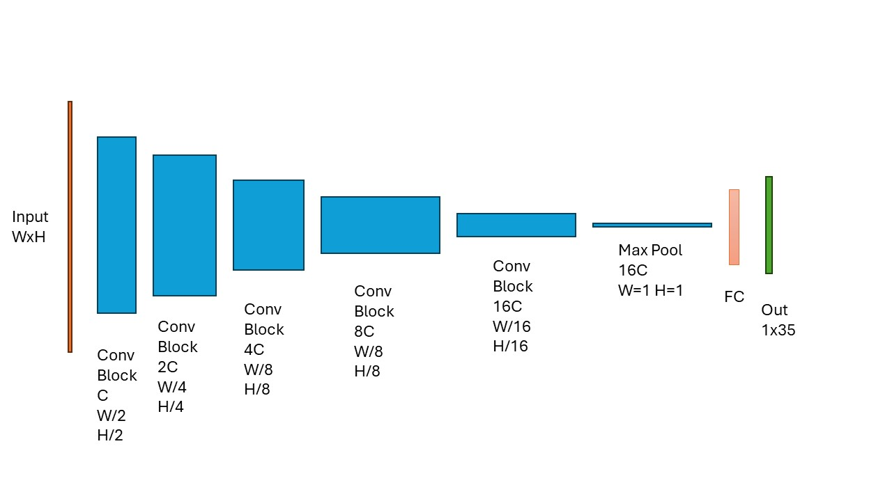

# Speech Commands Classification using UNet Encoder

This project is part of an Advanced Computer Architecture course. The goal of the project is to evaluate the performance of classifying the Google Speech Commands dataset using a custom UNet Encoder network architecture. The project explores various hyperparameters and data augmentations to optimize the model's performance.

## Project Overview

The main objective of this project is to classify speech commands accurately by leveraging a deep learning model. We implemented a UNet-like encoder network to process audio spectrograms derived from the Speech Commands dataset. This project includes:

- Training and evaluation of the UNet Encoder on the Speech Commands dataset.
- Application of different data augmentations to enhance model robustness.
- Hyperparameter optimization using Weights & Biases (wandb).

## Network Architecture

The model used in this project is a custom UNet Encoder. UNet is traditionally used for image segmentation tasks but is adapted here for classification by modifying the architecture to include a fully connected layer for output.

### UNet Encoder Architecture

The UNet Encoder consists of multiple convolutional blocks with batch normalization, ReLU activation, and dropout layers. Each block reduces the spatial dimensions while increasing the depth, effectively capturing hierarchical features of the input spectrograms.



*Figure 1: Our version of A U-Net Encoder. Our architecture adapts this design for the classification task.*

## Dataset

The Google Speech Commands dataset is used in this project. It contains one-second long utterances of 35 different words by thousands of speakers. The dataset is divided into training, validation, and test subsets.

### Example Mel Spectrogram

The audio data is converted into Mel Spectrograms before being fed into the model. A Mel Spectrogram is a time-frequency representation of the sound, emphasizing perceptual properties that are important for human hearing.


*Figure 2: Example of a Mel Spectrogram generated from an audio waveform.*

## Data Augmentation

To enhance the model's generalization ability, several data augmentations are applied:

1. **Volume Adjustment**: Changes the volume of the audio signal.
2. **Pitch Shift**: Alters the pitch of the audio, making the model more robust to variations in voice tone.
3. **Time Masking**: Temporarily masks a portion of the audio in the time domain.
4. **Frequency Masking**: Masks a portion of the audio in the frequency domain.

These augmentations are applied probabilistically during training to simulate real-world variations in audio signals.

## Hyperparameter Optimization

The project uses Weights & Biases (wandb) for tracking experiments and optimizing hyperparameters. The following parameters were explored:

- Learning Rate
- Beta values for Adam optimizer
- Dropout Probability
- Time and Frequency Masking Parameters
- Number of Filters in the Convolutional Layers

The sweep configuration in `wandb` was set up to perform a grid search over these hyperparameters to find the best model configuration.

## Installation

To run this project, you need to install the required Python packages. You can do this by running:

```bash
pip install -r requirements.txt
